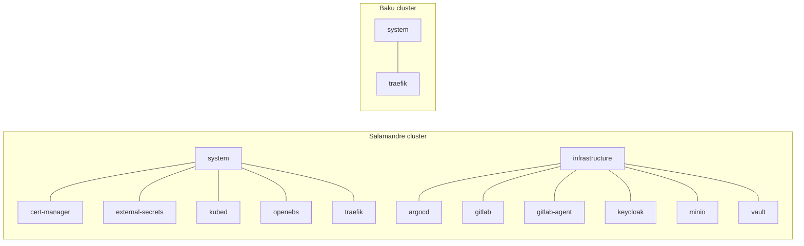
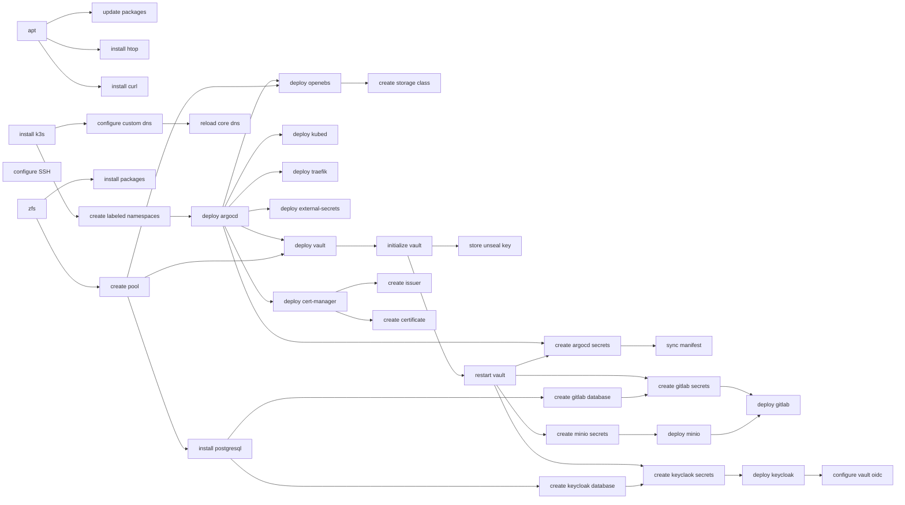

# Architecture overview

## Argo CD project structure

```mermaid
graph LR
  subgraph "Salamandre cluster"
    s-system[system] --- cert-manager
    s-system --- external-secrets
    s-system --- kubed
    s-system --- openebs
    s-system --- s-traefik[traefik]

    s-infrastructure[infrastructure] --- argocd
    s-infrastructure --- gitlab
    s-infrastructure --- gitlab-agent
    s-infrastructure --- keycloak
    s-infrastructure --- minio
    s-infrastructure --- vault
  end

  subgraph "Baku cluster"
    b-system[system] --- b-traefik[traefik]
  end
```

## Provisioning flow

```mermaid
graph LR
    apt --> update[update packages] & htop[install htop] & curl[install curl]
    k3s[install k3s]
    ssh[configure SSH]
    zfs --> zfs-pool[create pool] & zfs-install[install packages]

    zfs-pool --> postgresql[install postgresql]
    k3s --> namespaces[create labeled namespaces]
    k3s --> coredns[configure custom dns] --> cdns-reload[reload core dns]

    namespaces --> argocd[deploy argocd]
    argocd --> a-vault[create argocd secrets] --> a-sync[sync manifest]

    argocd --> cert-manager[deploy cert-manager]
    argocd --> kubed[deploy kubed]
    argocd --> traefik[deploy traefik]
    argocd --> external-secret[deploy external-secrets]
    argocd --> openebs[deploy openebs] --> sc[create storage class]
    argocd --> r-vault[deploy vault] --> v-init[initialize vault] --> v-keys[store unseal key]
    v-init --> vault[restart vault]

    vault --> m-vault[create minio secrets] --> minio[deploy minio]
    vault --> g-vault[create gitlab secrets] --> gitlab[deploy gitlab]
    vault --> k-vault[create keyclaok secrets] --> keycloak[deploy keycloak]

    %% Sub task
    cert-manager --> issuer[create issuer]
    cert-manager --> certificate[create certificate]

    keycloak --> v-oidc[configure vault oidc]

    %% Deps
    postgresql -----> g-db[create gitlab database] --> g-vault
    postgresql -----> k-db[create keycloak database] --> k-vault
    zfs-pool --> r-vault & openebs
    vault --> a-vault
    minio --> gitlab
```
